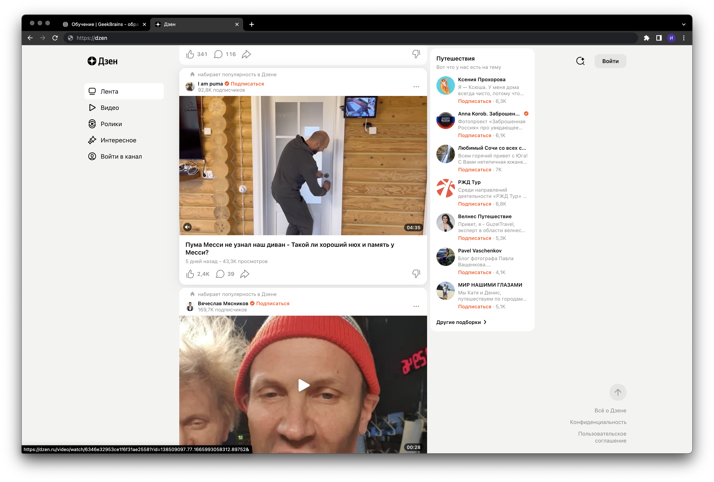
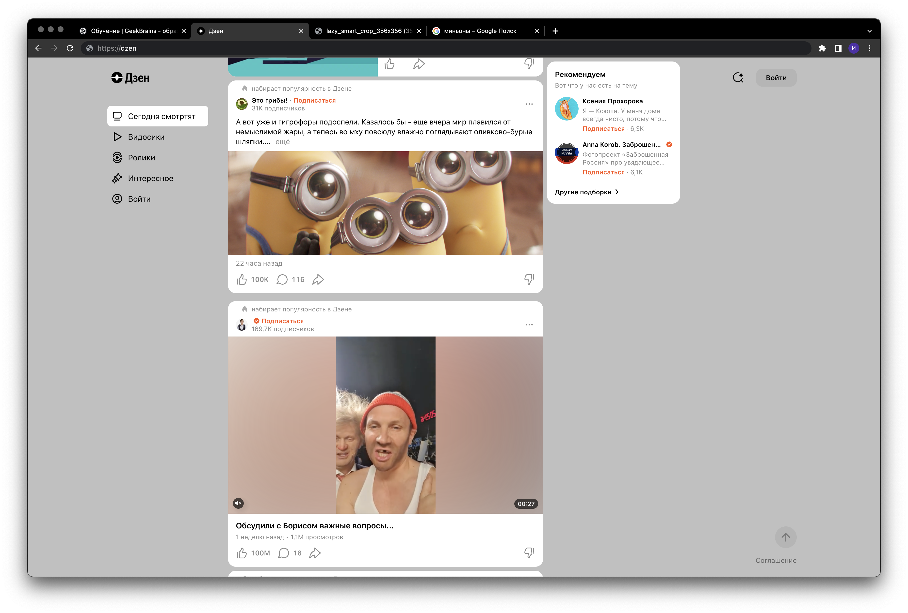
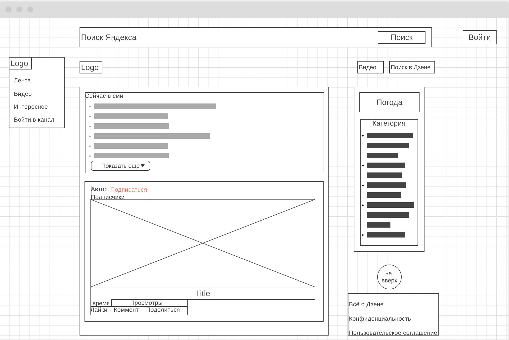

1. Сайт https://dzen.ru/ работает на прортоколе https.

2. Создайте файл analyze.txt, в котором проанализируйте структуру страницы сайта https://dzen.ru/ (опишите коротко, своими словами), а именно: 
* Есть ли шапка сайта.
* Есть ли подвал сайта.
* Как и где расположен контент, есть ли особенности у контента.
* Есть ли дополнительные элементы на странице (виджеты).

[analyze.txt](analyze.txt)

3. Внесите не менее 10 изменений на страницу https://dzen.ru/

Было

Стало

4. Прототип низкой детализации сайта https://dzen.ru/
